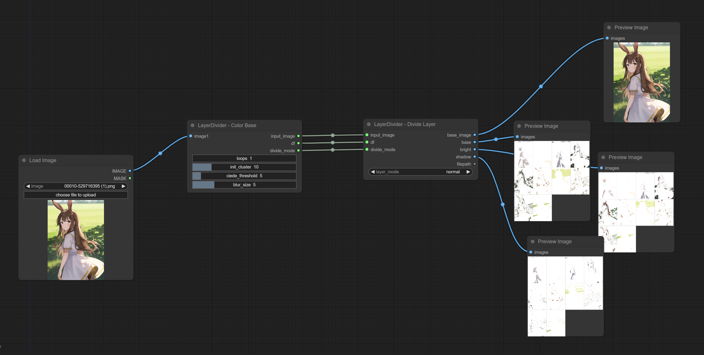
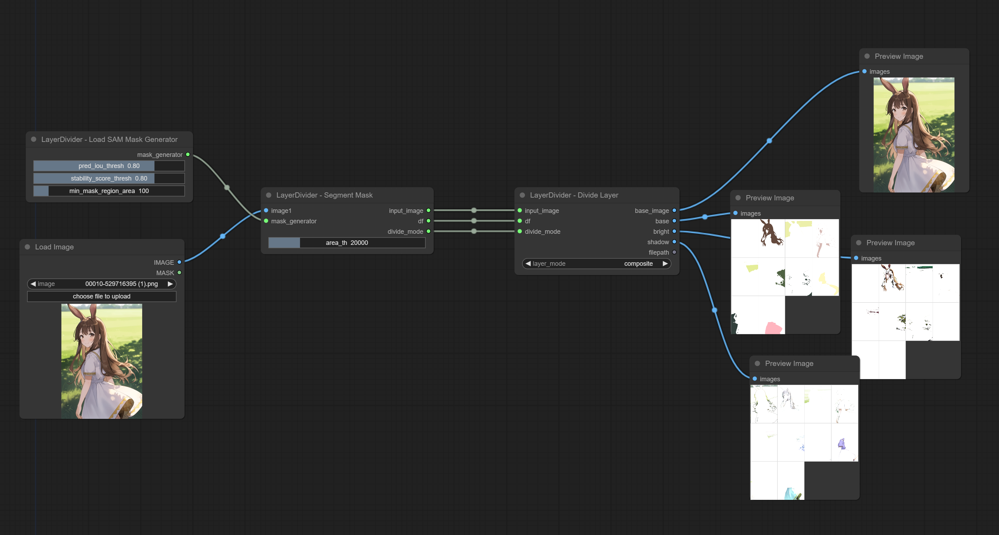
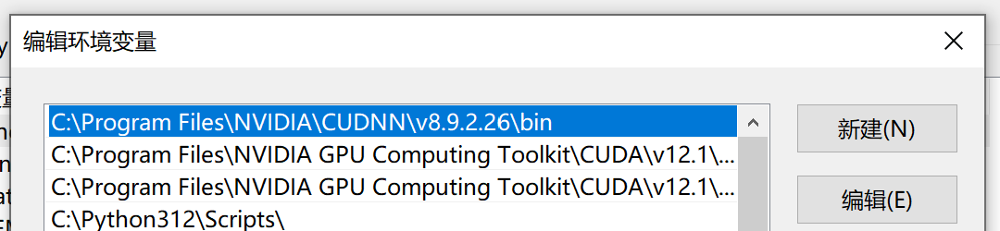
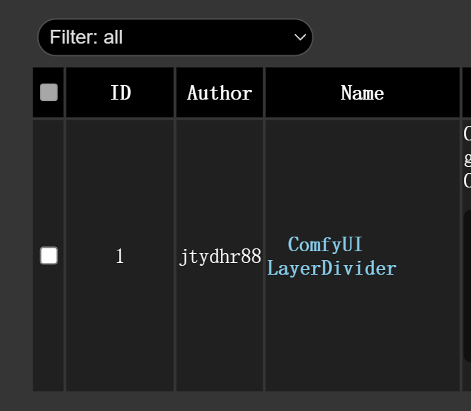
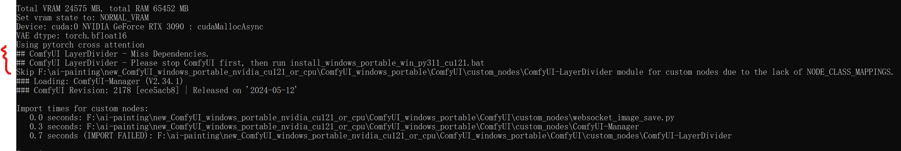

[EN](README.md) | [中文](README_ZH_CN.md)
# ComfyUI LayerDivider
**ComfyUI LayerDivider** 是在 ComfyUI 内生成分层 psd 文件的自定义节点，原始实现来自 [mattyamonaca/layerdivider](https://github.com/mattyamonaca/layerdivider)

https://github.com/jtydhr88/ComfyUI-LayerDivider/assets/860985/3ceb0638-1ed7-4e01-b231-03c4408c95e3

## 环境
我只测试了以下环境，可能在其他环境下也能工作，但我没有测试:

### 通用
1. Windows 10
2. GTX 3090
3. Cuda 12.1

### 环境 1 - 参见方法1
1. ComfyUI embedded python (python 3.11) and ComfyUI Manager

### 环境 2 - 参见方法2
1. conda
2. Python 3.10

## （通用）安装 - CUDA & cuDNN
这个库需要本地安装特定版本的 CUDA 和 cuDNN:
- 对于 CUDA，我只安装和测试了 CUDA 12.1，你可以从 https://developer.nvidia.com/cuda-12-1-0-download-archive 下载。
- 对于 cuDNN，必须是 v8.9.2 - CUDA 12.x (根据 https://github.com/mdboom/pytoshop/issues/9), 你可以从 https://developer.nvidia.com/rdp/cudnn-archive 下载
- 安装并解压后，确保配置系统变量的 PATH 

## （通用）安装  - Visual Studio Build Tools
可能还需要安装 Visual Studio Build Tools。
不过，我不确定因为我本地之前已经安装过了。 
如果需要，你可以从以下网址找到： [Visual Studio Build Tools](https://visualstudio.microsoft.com/downloads/?q=build+tools).

## (方法1) 安装 - ComfyUI Embedded Plugin & ComfyUI Manager 
1. 你可以直接在**comfyUI/custom_notes** 克隆本库 `git clone https://github.com/jtydhr88/ComfyUI-LayerDivider.git`
2. 或是使用 ComfyUI Manager 
3. 但是，无论是使用那种方式，第一次运行的时候都会失败 
4. 停止 ComfyUI
5. 然后进到 **custom_nodes\ComfyUI-LayerDivider**中，运行**install_windows_portable_win_py311_cu121.bat**

完成！

（如果你倾向使用conda或是python 3.10，参见下面）
## （方法2）安装 - ComfyUI
首先，这个插件依赖于 Python 3.10，这意味着我们不能使用 ComfyUI 自带的 Python，因为它是 Python 3.11。

由于这个原因，推荐使用 conda 管理和创建 ComfyUI 的运行环境：
- 使用 cmd/terminal 进入 comfyui 根文件夹（包含 run_cpu.bat 和 run_nvidia_gpu.bat） 
- `conda create --name comfy-py-310 python=3.10`
- `conda activate comfy-py-310`
- `pip install torch torchvision --extra-index-url https://download.pytorch.org/whl/cu121`
- `pip install -r ComfyUI\requirements.txt`

然后你可以运行 `python -s ComfyUI\main.py --windows-standalone-build` 来检查 ComfyUI 是否正常运行。

## （方法2）安装 - ComfyUI LayerDivider
然后我们可以克隆并配置这个库:
- `cd ComfyUI\custom_nodes`
- `pip install onnxruntime-gpu --extra-index-url https://aiinfra.pkgs.visualstudio.com/PublicPackages/_packaging/onnxruntime-cuda-12/pypi/simple/`
- `pip install Cython`
- `pip install pytoshop -I --no-cache-dir`
- `pip install psd-tools --no-deps`
- `git clone https://github.com/jtydhr88/ComfyUI-LayerDivider.git`
- `cd ComfyUI-LayerDivider`
- `pip install -r requirements.txt`

恭喜你！你完成了所有安装！

## 节点介绍
目前，这个扩展包括两种模式下的四个自定义节点，以及每种模式下的两种分层模式（normal 和 composite）：

### 模式
主要有两种分层模式：
- Color Base - 基于相似颜色进行分层，参数有:
  - loops 
  - init_cluster 
  - ciede_threshold 
  - blur_size
- Segment Mask - 先通过 [SAM - segment anything](https://segment-anything.com/) 进行图片分块识别，生成对应的 mask，然后根据这些 mask 进行分层。
  - Load SAM Mask Generator, 参数有（来自 segment anything，详细信息请 [参见](https://github.com/facebookresearch/segment-anything/blob/6fdee8f2727f4506cfbbe553e23b895e27956588/segment_anything/automatic_mask_generator.py#L61) ):
    - pred_iou_thresh 
    - stability_score_thresh 
    - min_mask_region_area
  - LayerDivider - 参数有:
    - area_th: 决定分区的数量，数值越小分区越多，数值越大分区越少

### 图层模式
在 Divide Layer 节点中使用，决定图层模式:
- normal - 为每个区域生成三个图层:
  - base - 基础图层
  - bright - 高光图层专注于图像中最亮的部分，增强这些区域的亮度和光泽
  - shadow - T阴影图层处理的是图像中较暗的部分，强调阴影和暗部的细节
- composite - 为每个区域生成五个图层：
  - base - 基础图层
  - screen - 滤色图层用于模拟光线的叠加效果。它将图像的颜色值与上方图层的颜色值进行相乘并反转，结果是一个比原始图像更亮的效果
  - multiply - 正片叠底图层用于模拟多个图像的叠加效果。它将图像的颜色值与上方图层的颜色值直接相乘，结果是一个比原始图像更暗的效果
  - subtract - 减去图层用于从基础图像中减去上方图层的颜色值，结果是一个颜色值较低的图像
  - addition - 加法图层用于将基础图像与上方图层的颜色值相加，结果是一个颜色值较高的图像

## 示例工作流程
这里有两个工作流程供参考
- [layerdivider-color-base.json](workflows/layerdivider-color-base.json) 
- [layerdivider-seg-mask.json](workflows/layerdivider-seg-mask-workflow.json) 

## 示例输出
- [output_color_base_composite.psd](docs/output_color_base_composite.psd)
- [output_color_base_normal.psd](docs/output_color_base_normal.psd)
- [output_seg_mask_composite.psd](docs/output_seg_mask_composite.psd)
- [output_seg_mask_normal.psd](docs/output_seg_mask_normal.psd)

## 已知问题
有时 composite 模式会在某些图像上失败，例如 ComfyUI 示例图像，正在调查原因...

## Python 3.11？ComfyUI 自带的 Python？
如上所述，原始库中的某些依赖包仅在 Python 3.10 中可用，而在 Python 3.11 中不可用。在此阶段，必须独立于 ComfyUI 自带的 Python 创建一个新的运行环境。

但是，未来可能会找到支持 Python 3.11 的方法。

## ComfyUI Manager?
我知道许多非技术用户依赖 ComfyUI Manager 进行插件安装和管理。然而，正如上述安装说明中提到的，这个插件本身需要一些本地配置、Python 版本和依赖安装顺序。

基于以上考虑，至少在目前不会在 ComfyUI Manager 上注册。 

## Credit & Thanks
- [mattyamonaca/layerdivider](https://github.com/mattyamonaca/layerdivider) - Original implement
- [ComfyUI](https://github.com/comfyanonymous/ComfyUI) - A powerful and modular stable diffusion GUI.

## My extensions for ComfyUI
- [ComfyUI-LayerDivider](https://github.com/jtydhr88/ComfyUI-LayerDivider) - ComfyUI InstantMesh is custom nodes that generating layered psd files inside ComfyUI
- [ComfyUI-InstantMesh](https://github.com/jtydhr88/ComfyUI-InstantMesh) - ComfyUI InstantMesh is custom nodes that running InstantMesh into ComfyUI
- [ComfyUI-ImageMagick](https://github.com/jtydhr88/ComfyUI-ImageMagick) - This extension implements custom nodes that integreated ImageMagick into ComfyUI
- [ComfyUI-Workflow-Encrypt](https://github.com/jtydhr88/ComfyUI-Workflow-Encrypt) - Encrypt your comfyui workflow with key

## My extensions for stable diffusion webui
- [3D Model/pose loader](https://github.com/jtydhr88/sd-3dmodel-loader) A custom extension for AUTOMATIC1111/stable-diffusion-webui that allows you to load your local 3D model/animation inside webui, or edit pose as well, then send screenshot to txt2img or img2img as your ControlNet's reference image.
- [Canvas Editor](https://github.com/jtydhr88/sd-canvas-editor) A custom extension for AUTOMATIC1111/stable-diffusion-webui that integrated a full capability canvas editor which you can use layer, text, image, elements and so on, then send to ControlNet, basing on Polotno.
- [StableStudio Adapter](https://github.com/jtydhr88/sd-webui-StableStudio) A custom extension for AUTOMATIC1111/stable-diffusion-webui to extend rest APIs to do some local operations, using in StableStudio.
- [Txt/Img to 3D Model](https://github.com/jtydhr88/sd-webui-txt-img-to-3d-model) A custom extension for sd-webui that allow you to generate 3D model from txt or image, basing on OpenAI Shap-E.
- [3D Editor](https://github.com/jtydhr88/sd-webui-3d-editor) A custom extension for sd-webui that with 3D modeling features (add/edit basic elements, load your custom model, modify scene and so on), then send screenshot to txt2img or img2img as your ControlNet's reference image, basing on ThreeJS editor.

